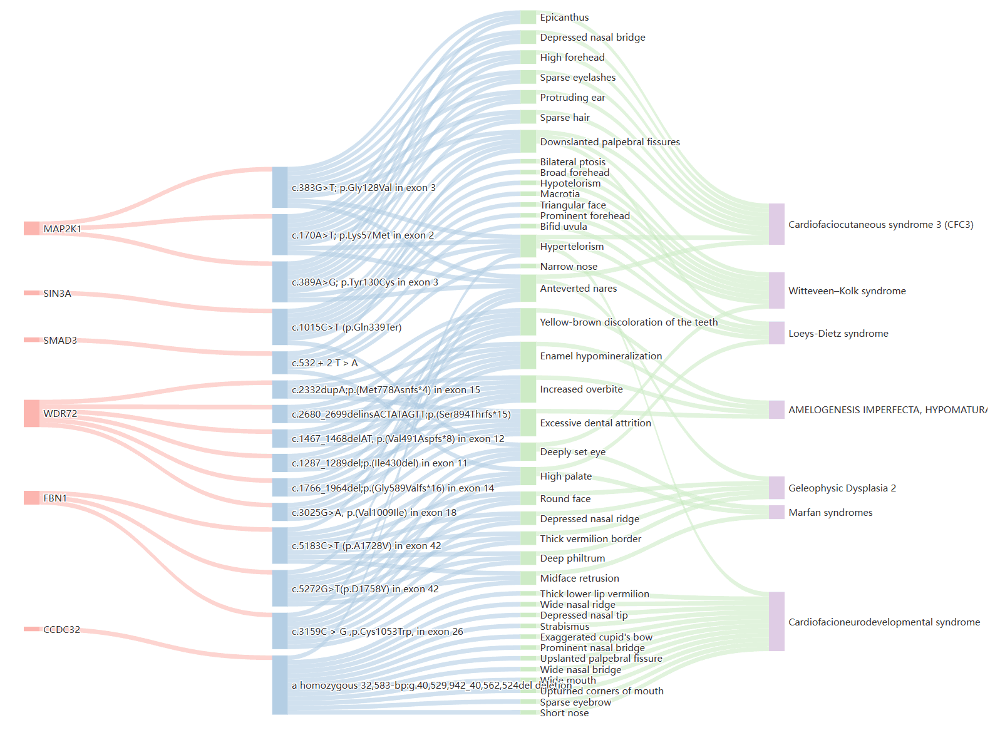

# FGDD
FGDD is a tabular dataset on facial phenotypes-gene-disease that can support the training of diagnostic disease models and explore the complex relationship between facial phenotypes-gene-disease.   
A sample of 50 records is available here, please contact the author for a complete dataset.

