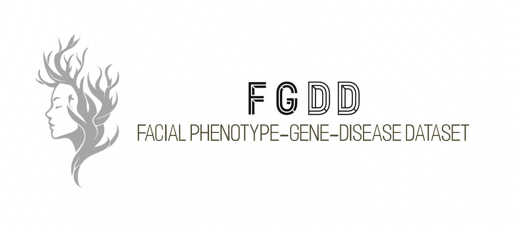
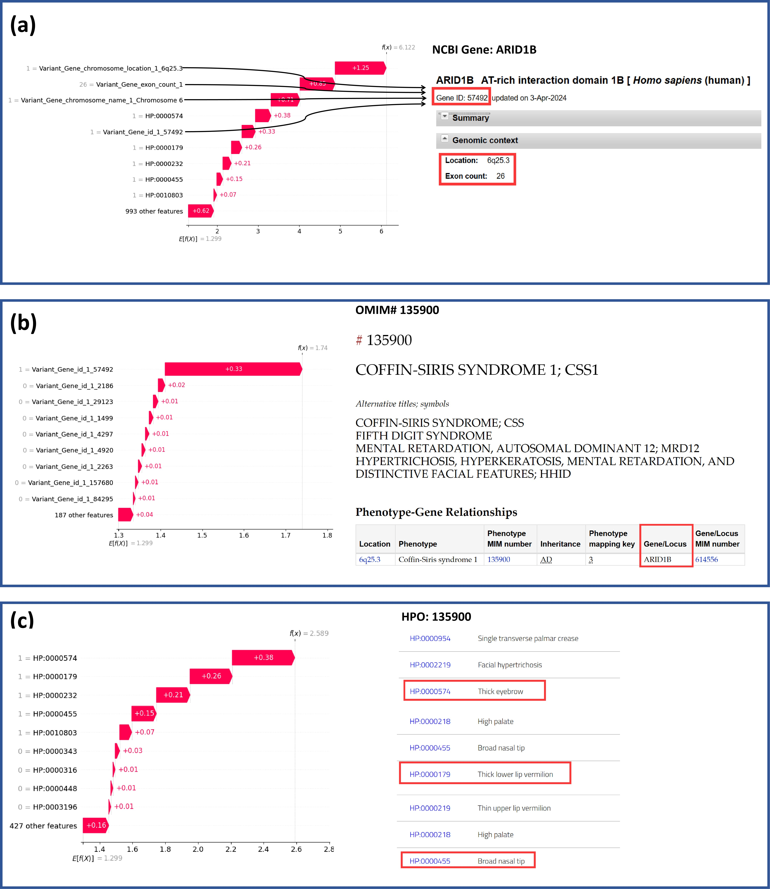

<div align="center">
  
</div>


<div align="center">    

# An explainable dataset linking facial phenotypes and genes to rare genetic diseases

</div>

[](https://opensource.org/licenses/MIT)

 


## 🌐 Overview
**FGDD are available at [figshare](https://doi.org/10.6084/m9.figshare.28516604.v3)**
**Full papers are available at [scientific data]([https://doi.org/10.6084/m9.figshare.28516604.v3](https://www.nature.com/articles/s41597-025-04922-z))**
<div align="center">
  
</div>

## 🌟 Features

- We propose a new dataset, FGDD, for facial phenotype analysis of rare genetic diseases, which can be used not only for training explainable diagnostic models but also for in-depth analysis of the complex gene-disease-facial phenotype relationships and for mining more potential associations and patterns. 
- We have conducted extensive benchmarking on our dataset, and commonly used machine learning models can achieve up to 81% accuracy and provide clinical support. 
- We conducted an explainability analysis from both local and global perspectives, and the models trained on FGDD can provide explainable predictions that can be corroborated by relevant research, and enhance physicians’ confidence in the model results, which is particularly important in the medical field.


## 📁 File Description
- **`Baselines.ipynb`**: Contains the baseline model implementation and analysis. 
- **`Explainability analysis.ipynb`**: Includes code for explainability experiments and visualizations. 
- **`Construct KG.ipynb`**: Contains the code for constructing the Knowledge Graph (KG) from the dataset, including graph building.
- **`Search terms construction.ipynb`**: Includes the process of generating search terms used in the research. 
- **`requirements.txt`**: Lists all the dependencies required for the project.
- **`README.md`**: Documentation file for the repository. 
- **`LICENSE`**: MIT LICENSE. 


## 💡 A Specific Use Case
<div align="center">
  
  Explainability analysis of model single prediction.
</div>

Local explanations are concerned with explaining the reasons for individual predictions or decisions, answering the question "Why did the model make this prediction for this sample?" Here, we explain individual patient predictions based on SHAP, a cooperative game-theoretic feature importance calculation method.

Fig above shows a local explanation of a patient with a model diagnosis of COFFIN-SIRIS SYNDROME 1 ([OMIM 135900](https://www.omim.org/entry/135900)).

- **(a)** shows the effect of all features on individual prediction results using SHAP analysis, among which the gene _ARID1B_ ([NCBI Gene: 57492](https://www.ncbi.nlm.nih.gov/gene/57492)) has the greatest effect on the prediction results of the model. Searching for _ARID1B_ in the NCBI Gene database, we can find that chromosome and exon count are all _ARID1B_-related information in the figure.

- **(b)** shows the effect of genes on individual predictions in the SHAP analysis, with _ARID1B_ having the largest effect, leading to speculation about the basis of the model's predictions - that _ARID1B_ plays a critical role in the pathogenesis of COFFIN-SIRIS SYNDROME 1. In order to verify the plausibility of this speculation, search for [COFFIN-SIRIS SYNDROME 1](https://www.omim.org/entry/135900) on OMIM and find that it is indeed associated with _ARID1B_. This is also supported by the relevant research[1-3].

- **(c)** shows the effect of facial phenotypes on individual predictions in the SHAP analysis, HP:0000574, HP:0000179, HP:0000232, HP:0000455, HP:0010803 have the greatest impact on the predictions, where HP:0000574, HP:0000179, HP:0000455 in the [HPO](https://hpo.jax.org/app/browse/disease/OMIM:135900) can all be found associated with COFFIN-SIRIS SYNDROME 1.


## 🚀 Usage
1. Clone the repository:
   ```bash
   git clone https://github.com/zhelishisongjie/FGDD.git
   cd FGDD
   ```
2. Create a virtual environment (optional but recommended):
    ```bash
    python -m venv env
    source env/bin/activate       # For Linux/Mac
    env\Scripts\activate          # For Windows
    ```
3. Install the required dependencies:
    ```bash
    pip install -r requirements.txt
    ```


## 📜 License
MIT License  
The full agreement is available in the LICENSE file

## 📚 Citation
```bash
Song, J., He, M., Ren, S. et al. An explainable dataset linking facial phenotypes and genes to rare genetic diseases. Sci Data 12, 634 (2025). https://doi.org/10.1038/s41597-025-04922-z
```
